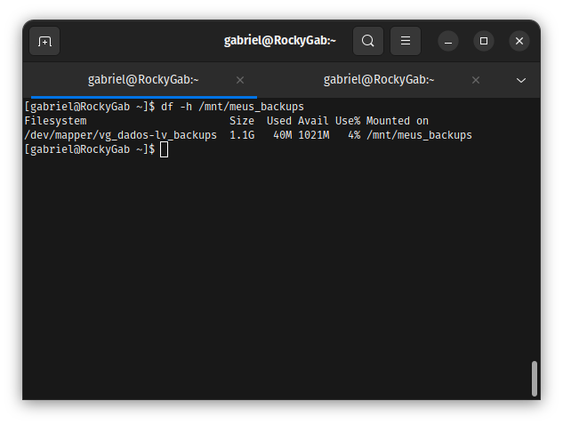
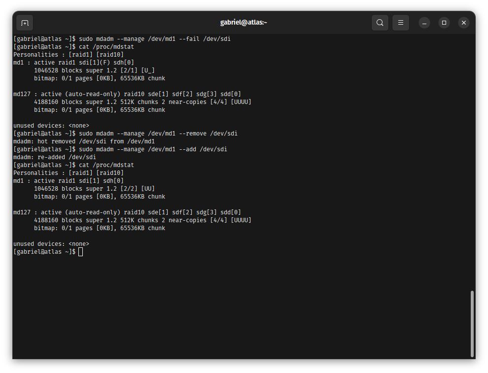
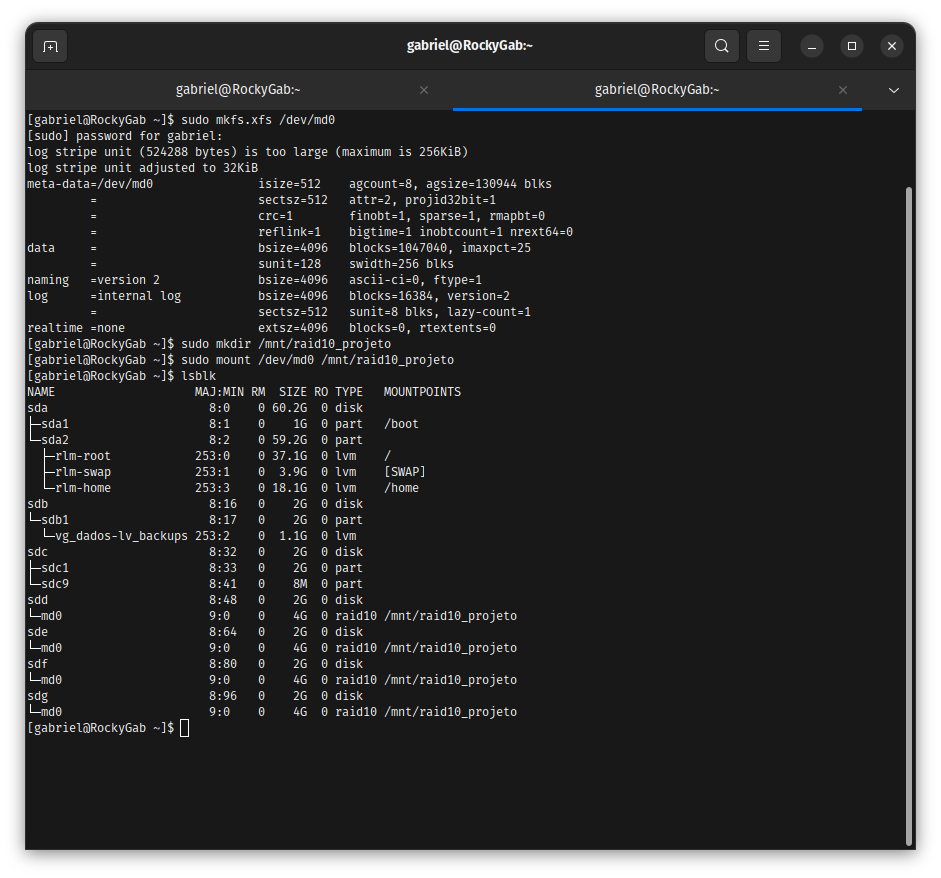
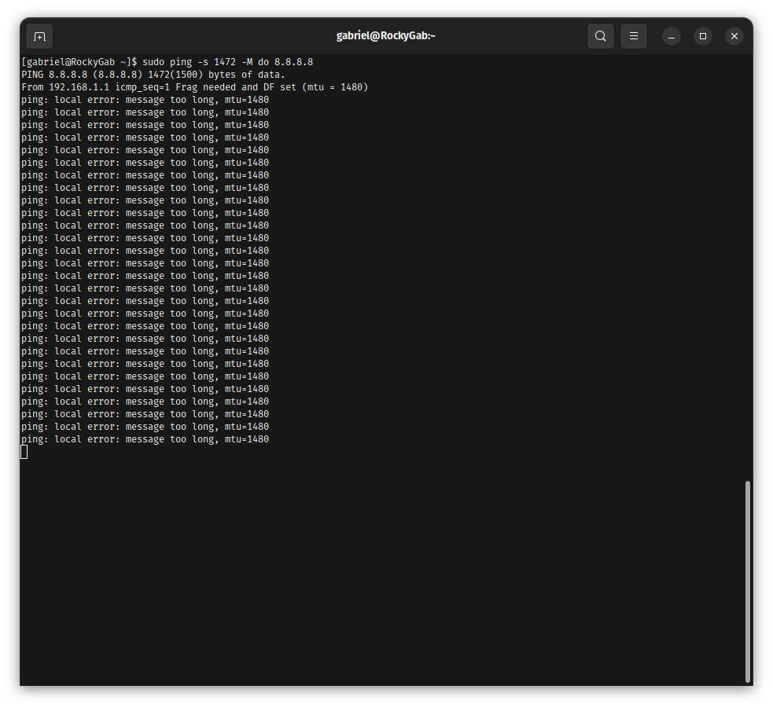
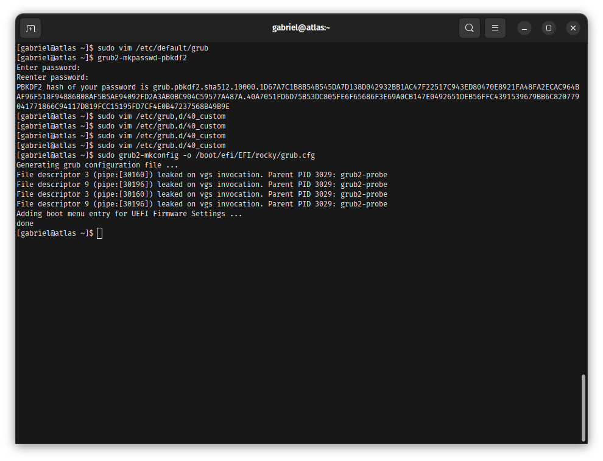
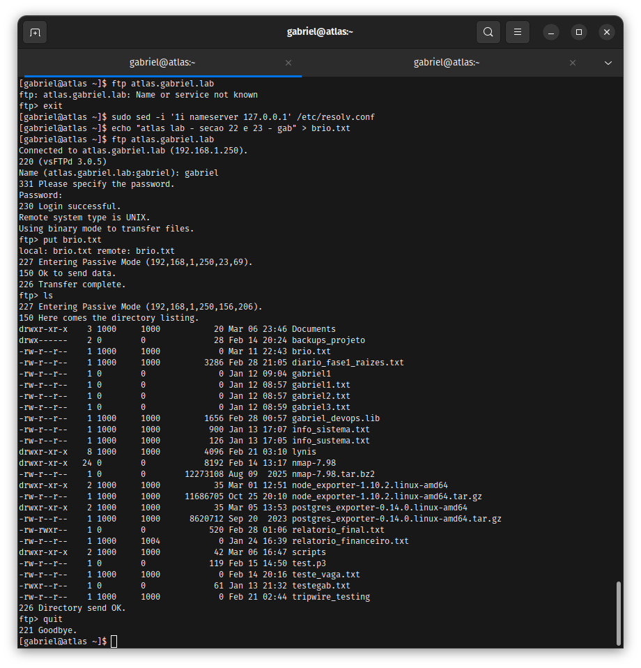
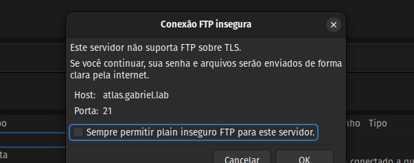

# Backbone Infrastructure & Networking 🛡️

Repositório focado na camada de missão crítica da infraestrutura. Este laboratório documenta a implementação de um **Backbone resiliente**, focado em **Continuidade de Negócio (BCP)**, alta disponibilidade de armazenamento (RAID) e governança de serviços de borda (DNS/DHCP/Mail).

## 🎯 Business Value & Resiliência
O objetivo central deste backbone é garantir **Zero Data Loss** através de redundância de hardware via software (RAID) e **Autonomia de Rede**, estabelecendo serviços autoritativos locais que independem de conexões externas para a operação interna da empresa.

---

## Stack Tecnológica & Matriz de Arquitetura
* **Sistemas Operacionais:** Rocky Linux 9 (Core Services) & Ubuntu Server.
* **Storage:** RAID 1, RAID 10 (mdadm) e LVM2 (Logical Volume Management).
* **Network Services:** BIND9 (DNS), ISC DHCP Server, Dovecot (IMAP/POP3), vsftpd.
* **Segurança:** GRUB2 Hardening (PBKDF2) e Firewalling de Borda.

### Matriz de Serviços de Backbone
| Camada | Tecnologia | Estratégia de Resiliência | Função no Ecossistema |
| :--- | :--- | :--- | :--- |
| **Storage Mirror** | RAID 1 | Redundância de Disco (Mirroring) | Proteção de Dados Críticos |
| **Performance Disk**| RAID 10 | Stripping + Mirroring | Alta Performance e Tolerância a Falhas |
| **Logical Storage** | LVM2 | Snapshots / Hot-Resize | Flexibilidade de Expansão sem Downtime |
| **IP Management** | DHCP Server | Escopo Autoritativo | Governança de Endereçamento |
| **Naming Service** | BIND9 DNS | Master Zone / Reverse Lookup | Resolução de Nomes e Identidade de Rede |

---

## 📁 1. Gestão de Borda (DNS & DHCP Autoritativo)

### Contexto do Problema
A necessidade de uma rede interna organizada exige que o servidor gerencie dinamicamente os IPs e resolva nomes locais (`atlas.gabriel.lab`) para evitar o uso de IPs "hardcoded" em aplicações.

### Troubleshooting (Causa Raiz)
* **Incidente:** Falha de resolução `NXDOMAIN` no Master Zone.
* **Resolução:** Correção da hierarquia de permissões no diretório `/var/named` e ajuste de sintaxe no arquivo de zona reversa para alinhar o PTR ao endereçamento estático.

### Evidência Técnica

  
📂 Clique para ver a Validação de Borda

  * **DHCP Operacional:** 
  * **Resolução DNS Master:** 

---

## 📁 2. Armazenamento Flexível (LVM & XFS Expansion)

### Contexto do Problema
Servidores de arquivos e logs crescem de forma imprevisível. O sistema precisava de uma camada de abstração que permitisse aumentar o espaço em disco com o sistema montado.

### Troubleshooting (Hot-Resize)
* **Solução Aplicada:** Uso de `lvextend` seguido de `xfs_growfs`. Diferente do EXT4, o XFS exige que o volume esteja montado para ser expandido, garantindo a continuidade do serviço.

### Evidência Técnica

  
📂 Clique para ver o Ciclo LVM

  * **Provisionamento XFS:** 
  * **Hot-Resize Success:** 
  * **Verificação Final:** 

---

## 📁 3. [GOLDEN EVIDENCE] SRE Incident: RAID 1 Disaster Recovery

### Contexto do Problema
Simulação de falha física catastrófica em um dos discos (`sdi`) do array de espelhamento que sustenta o banco de dados.

### Troubleshooting & Resolução (SRE Hands-on)
1. **Identificação:** Detecção de estado degradado `[U_]` via `/proc/mdstat`.
2. **Isolamento:** Marcação do disco como `faulty` e remoção lógica do array.
3. **Rebuild:** Inserção de novo disco e monitoramento da sincronização de blocos em tempo real para restaurar a redundância `[UU]`.

### Evidência Técnica

  
📂 Clique para ver o Rebuild do RAID

  * **Array Degradado:** 
  * **Processo de Rebuild:** 
  * **Visão Integrada (lsblk):** 

---

## 📁 4. Deep Dive Networking: Análise de MTU e Latência

### Contexto do Problema
Diagnosticar gargalos de rede que impedem a transferência eficiente de pacotes grandes ou causam fragmentação excessiva.

### Investigação Técnica
Uso de **MTU Path Discovery** para identificar o tamanho máximo de frame sem fragmentação e análise de saltos via **MTR** para detectar pacotes descartados em gateways intermediários.

### Evidência Técnica

  
📂 Clique para ver o Diagnóstico de Rede

  * **Falha (MTU 1500):** 
  * **Sucesso (MTU 1480):** 
  * **Análise Hop-by-Hop:** 

---

## 📁 5. Security Hardening: GRUB2 & PBKDF2

### Contexto do Problema
Proteção física contra "Single User Mode Break-ins". Impedir que o Kernel seja manipulado no boot sem autenticação de alto nível.

### Resolução
Implementação de criptografia de senha no bootloader utilizando o algoritmo de derivação de chave **PBKDF2**, garantindo resistência contra ataques de dicionário ao arquivo de configuração do GRUB.

### Evidência Técnica

  
📂 Clique para ver a Trava do Bootloader

  * **Hash PBKDF2:** 
  * **Update Config:** 

---

## 📁 6. Legacy Services & Security (Mail & FTP)

### Contexto do Problema
Manter serviços de comunicação clássicos (Dovecot/vsftpd) operando sob monitoramento rigoroso e validação de protocolos.

### Evidência Técnica

  
📂 Clique para ver a Validação de Serviços

  * **IMAP/POP3 Verification:** 
  * **FTP DNS Integration:** 
  * **Audit Alert (Security):** 

---

> [!NOTE]
> **SRE Insight: O Custo do "Omission Error"**
> Durante o laboratório de fdisk, o sistema emitiu um alerta de "Disk in use". A decisão de SRE foi interromper a operação, desmontar os volumes e limpar o cache de escrita, evitando a corrupção da tabela de partições que causaria perda total do array.
> 
