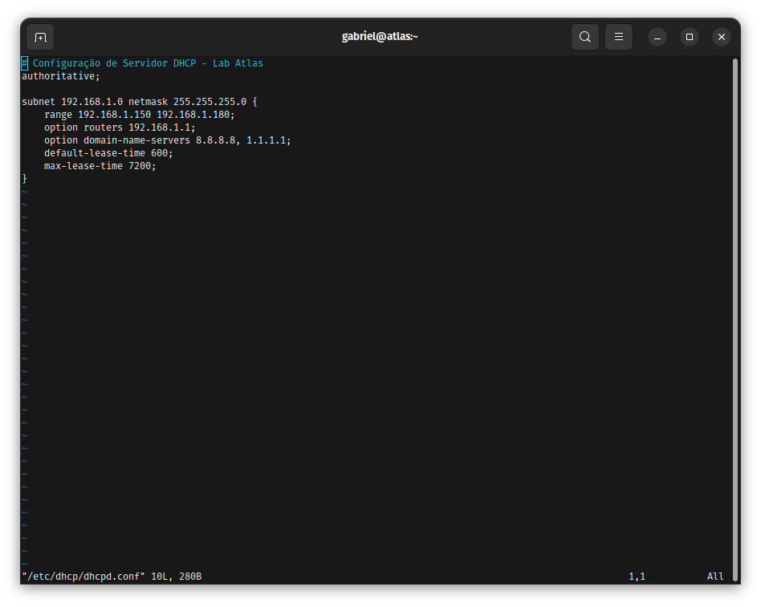
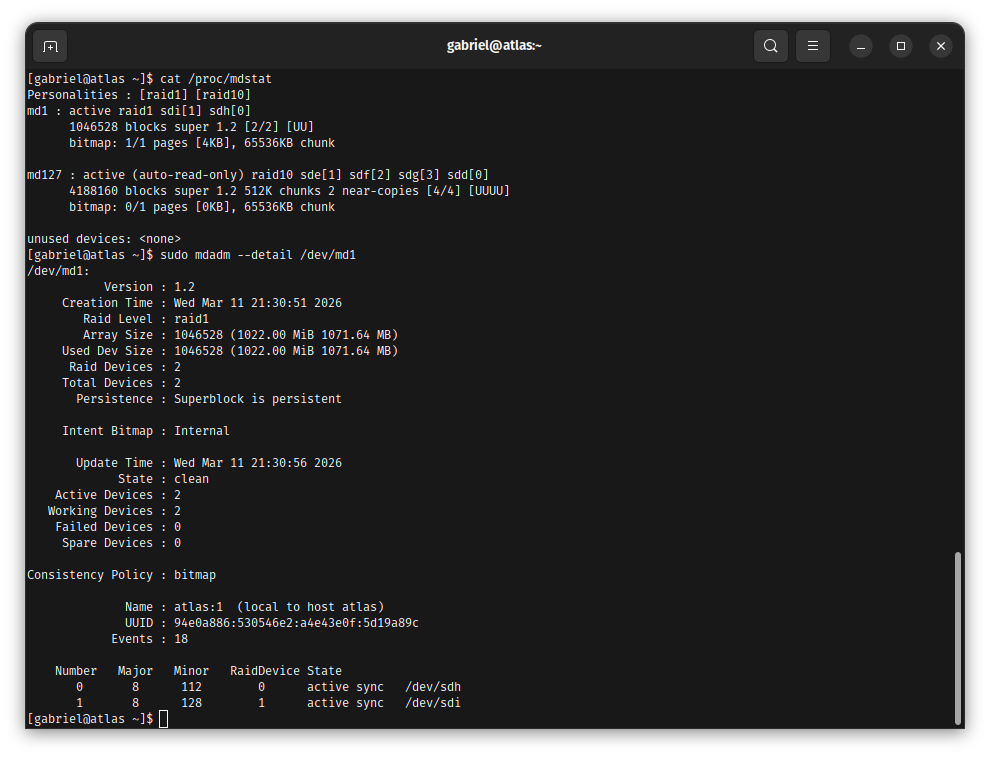
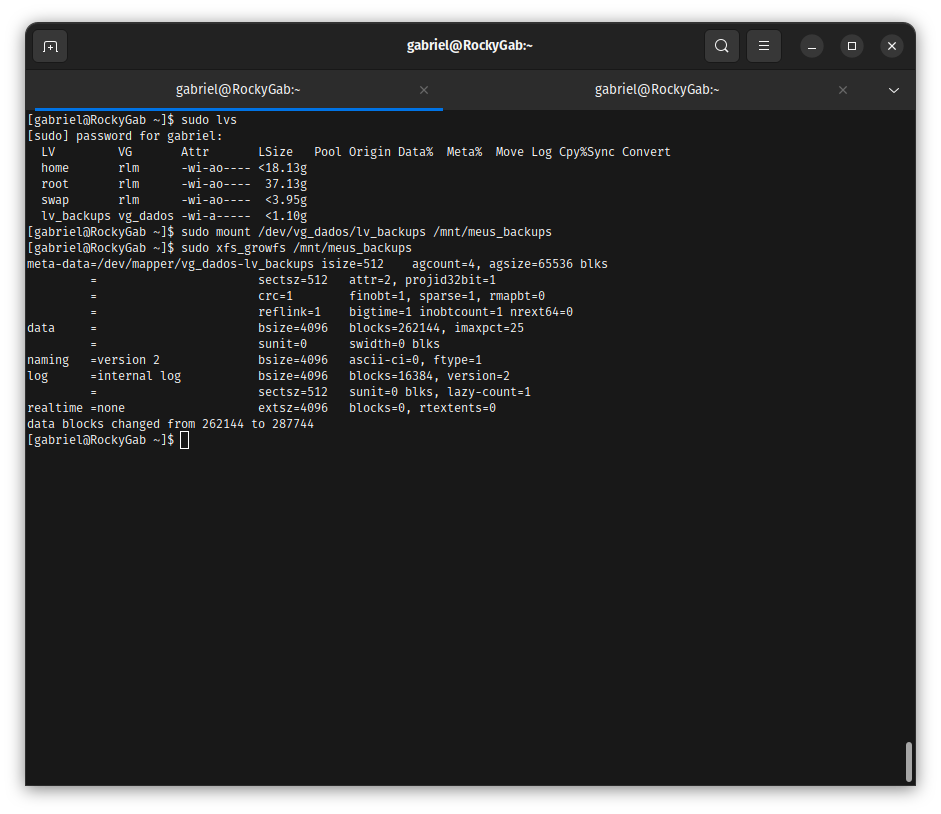
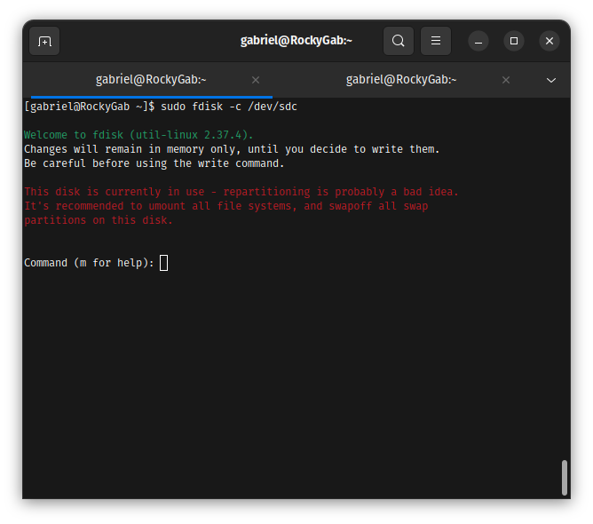
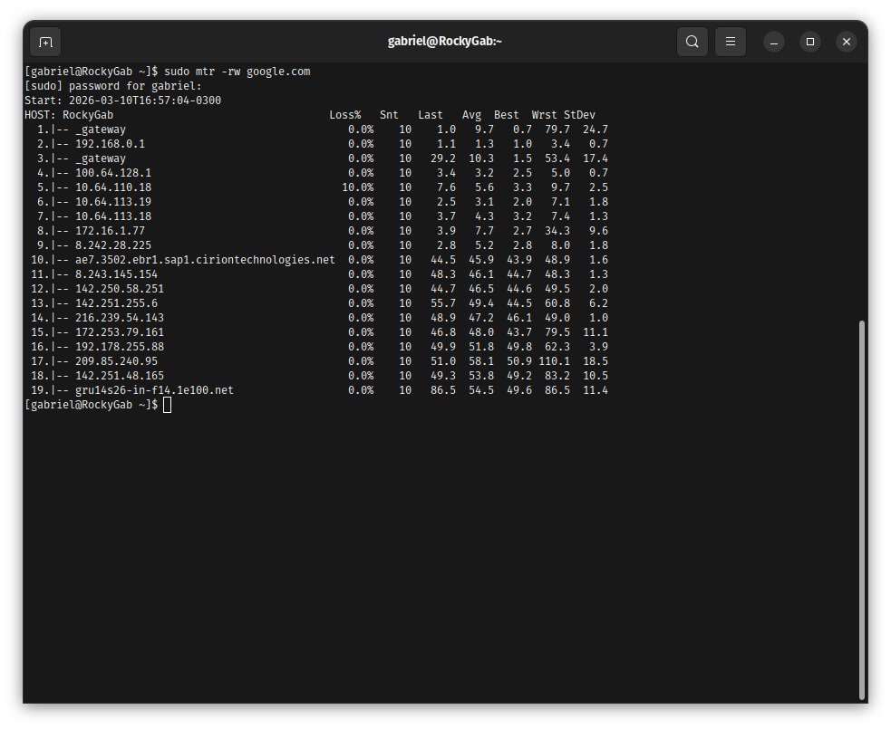
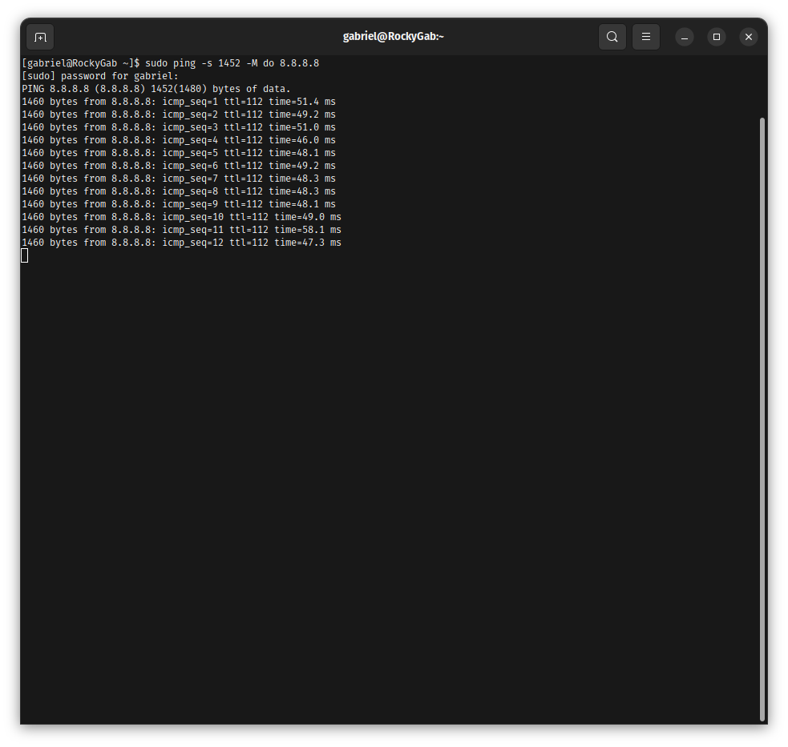

cat << 'EOF' > README.md
# Repo 4: Backbone Infrastructure & Networking 🛡️

Repositório dedicado à construção e administração de infraestrutura Linux avançada. Este laboratório documenta a implementação de serviços críticos, escaláveis e resilientes utilizando **Rocky Linux 9 (Enterprise Ready)** e **Ubuntu Server**.

---

## 🛠️ Stack Tecnológica
* **Distribuições:** Rocky Linux 9 & Ubuntu Server
* **Armazenamento:** LVM2 & RAID 1 (mdadm)
* **Segurança:** GRUB2 (Hardening com PBKDF2)
* **Rede/Serviços:** BIND9 (DNS), ISC DHCP, Dovecot (Mail), ProFTPD

---

## 1. Gestão de Endereçamento Dinâmico (DHCP Server)
Implementação de um servidor DHCP autoritativo para gestão centralizada e automatizada de rede local.

* **Foco em Segurança:** Controle de escopo para evitar esgotamento de IPs e garantia de persistência para ativos críticos.
* **Metodologia:** Configuração de range e validação rigorosa de sintaxe via CLI.

📂 Visualizar Metodologia e Evidências (DHCP)

\`\`\`bash
# Validação de sintaxe antes do deploy
dhcpd -t -cf /etc/dhcp/dhcpd.conf
\`\`\`
* **Escopo:** 
* **Status:** 
* **Instalação:** [Pacote Instalado](./docs/assets/evidence-dhcp-package-installed.png)

---

## 2. Armazenamento Resiliente e Alta Disponibilidade (RAID 1 & LVM)
Implementação do pilar de **Disponibilidade (CIA Triad)** através de redundância de hardware e gestão de volumes lógicos.

### 2.1. Cenário de Falha e Recuperação (RAID 1)
* **Evento:** Configuração de espelhamento via \`mdadm\` com simulação de falha física e rebuild ativo.
* **Evidência:** 

### 2.2. Gestão LVM e Hot-Resize
* **Cenário:** Expansão dinâmica de volumes (\`lvextend\`) em resposta a alertas de ocupação (Disk Pressure).
* **Evidência:** 

📂 Detalhes Técnicos de Storage e RAID

* [Rebuild Process](./docs/assets/mdadm-raid1-recovery-rebuild.png)
* [Status RAID 10](./docs/assets/mdadm-status-raid10.png)
* [Verificação Final Storage](./docs/assets/df-h-final-verification-lv-backups-1.1G.png)

---

## 3. Post-Mortem: Troubleshooting de Kernel e Discos (SRE)
Diagnóstico de falhas reais capturadas durante a manipulação de infraestrutura de blocos.

### Diagnóstico e Resolução
1. **Identificação:** Erro de bloqueio detectado via \`fdisk\` (Device or resource busy).
2. **Decisão:** Análise de descritores e metadados para liberação de partições em uso.
3. **Resultado:** Normalização do particionamento e sincronização do array.

📂 Visualizar Evidências de Diagnóstico (27 Evidências Totais)

* **Erro de Disco:** 
* **Análise MTR:** 
* **MTU Discovery:** 
* **Erro de Rede:** [Troubleshooting Network](./docs/assets/Troubleshooting_Network_Error.png)

---

## 4. Hardening de Bootloader (GRUB2 Security)
Proteção da camada pré-SO contra acessos físicos e escalonamento de privilégios via modo de edição do kernel.

* **Metodologia:** Implementação de autenticação obrigatória via hash criptográfico **PBKDF2**.
* **Evidência:** 

📂 Detalhes de Hardening

* [Update UEFI](./docs/assets/grub-mkconfig-uefi-update.png)
* [Geração do Hash](./docs/assets/Captura%20de%20tela%20de%202026-03-11%2021-42-13.png)

---

## 5. Conectividade e Mensageria (DNS, Mail & FTP)
Provisionamento dos serviços de borda e transporte do Backbone Atlas.

📂 Validação de Serviços (Zonas DNS, Dovecot e FTP)

* **DNS Master:** 
* **Mail IMAP:** 
* **FTP Final:** 
* **Dovecot Telnet:** [Auth Validation](./docs/assets/Dovecot_Auth_Validation_Telnet.png)
* [FTP Integration DNS](./docs/assets/FTP_Integration_DNS_Validation_Transfer.png)

---

## Automações de Infraestrutura (IaC & SRE)
Para garantir a escalabilidade e a alta disponibilidade, implementei scripts de automação:

* **[setup_backbone_storage.sh](./scripts/setup_backbone_storage.sh):** Provisionamento automático de RAID 1, VG, LV e montagem de File System.
* **[monitor_backbone_health.sh](./scripts/monitor_backbone_health.sh):** Verificação de integridade do RAID e auto-recuperação de serviços (Self-healing).
* **[lvm_snapshot_backup.sh](./scripts/lvm_snapshot_backup.sh):** Gestão de Snapshots LVM para garantir rollback rápido antes de alterações críticas.
* **[network_backup_manager.sh](./scripts/network_backup_manager.sh):** Backup automatizado das configurações de interfaces e escopos DHCP.
* **[backbone_service_check.sh](./scripts/backbone_service_check.sh):** Validador de conectividade e resolução DNS para garantir a saúde do Backbone.
* **[raid_integrity_check.sh](./scripts/raid_integrity_check.sh):** Auditoria específica de integridade de arrays RAID e monitoramento de discos falhos.

## Lab Setup (Autenticidade Garantida)
* **Ambiente:** Terminal \`rockygab\`
* **Prova de Sessão:** 

EOF
