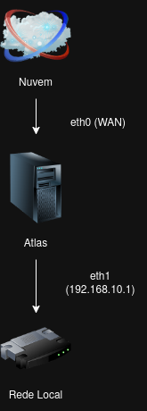
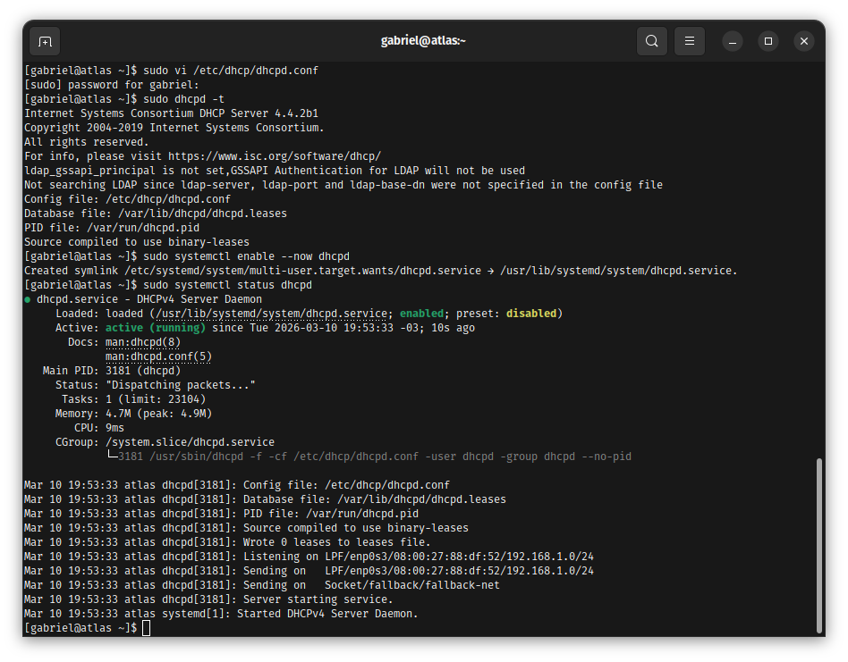
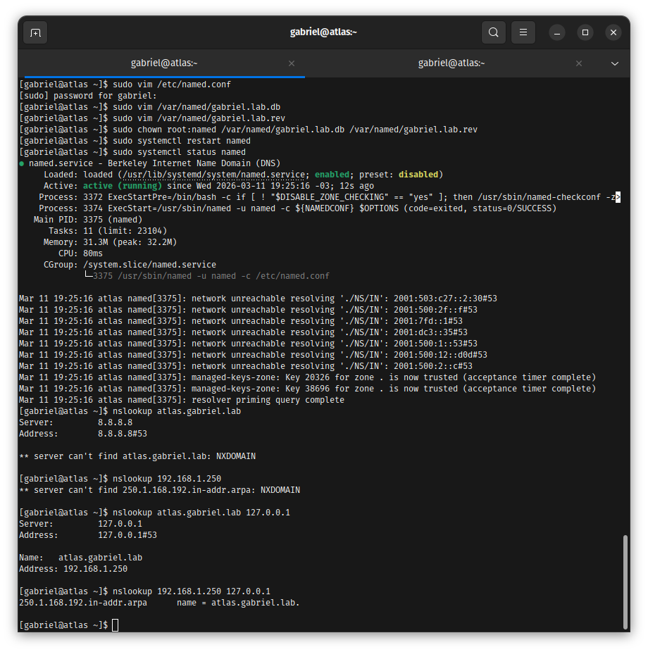
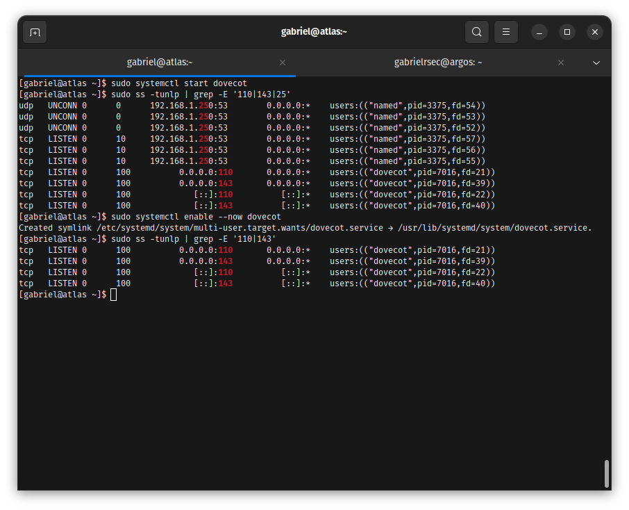
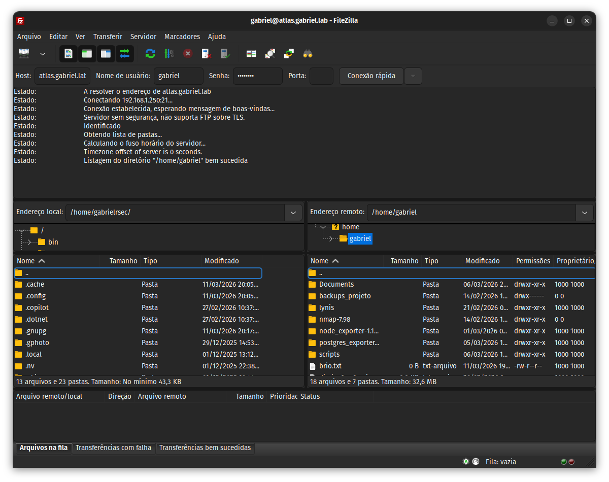
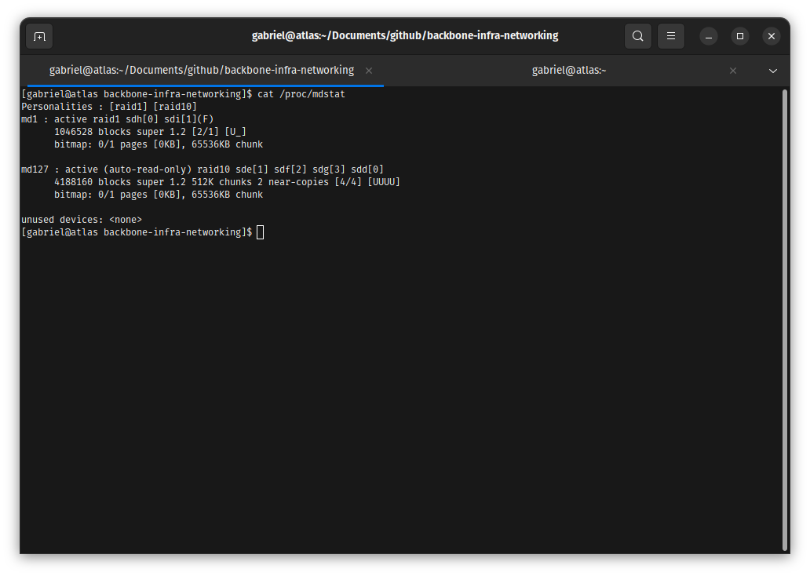
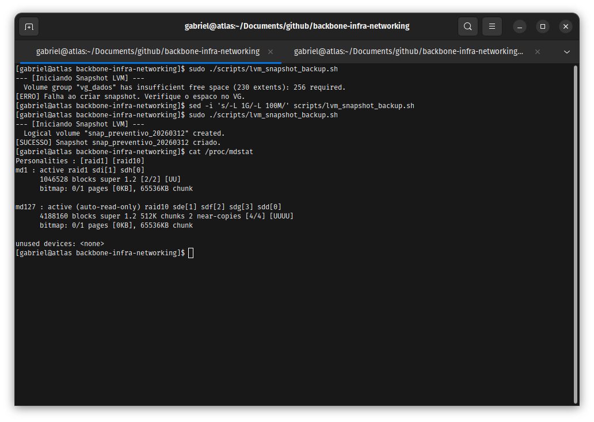
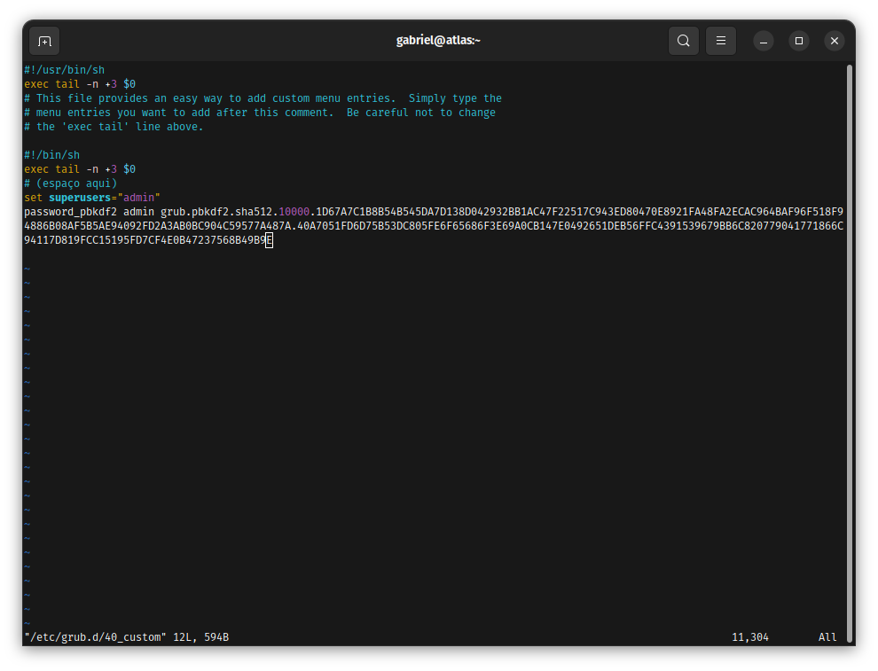
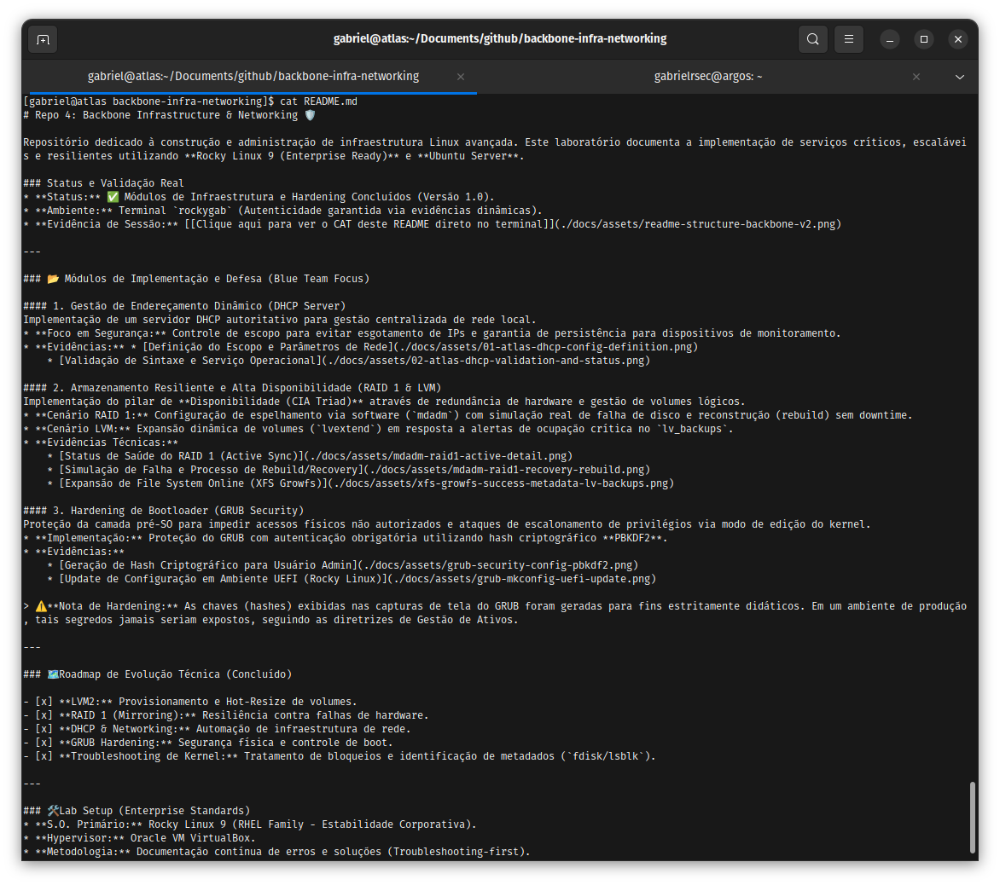

# Repo 4: Backbone Infrastructure & Networking 🛡️

Repositório dedicado à construção e administração de infraestrutura Linux avançada. Este laboratório documenta a implementação de serviços críticos, escaláveis e resilientes utilizando **Rocky Linux 9 (Enterprise Ready)** e **Ubuntu Server**.

---

## 🛠️ Stack Tecnológica & Topologia
* **Distribuições:** Rocky Linux 9 & Ubuntu Server
* **Armazenamento:** RAID 1, RAID 10 e LVM2
* **Segurança:** GRUB2 (Hardening com PBKDF2)

### Topologia da Rede

  
📂 Clique para ver o Diagrama de Backbone

  

### Endereçamento e Funções
| Serviço | Interface | Rede/Volume | Função |
| :--- | :--- | :--- | :--- |
| **DHCP/DNS Server** | eth1 | 192.168.10.0/24 | Gestão de Identidade e IPs da Rede |
| **Mirroring Storage** | md1 | RAID 1 (2 Discos) | Dados Críticos e Redundância |
| **Performance Cluster**| md127| RAID 10 (4 Discos)| Alta Performance e Tolerância a Falhas |
| **LVM Snapshots** | vg_dados| lv_backups | Salvaguarda de Dados (Point-in-Time) |

---

## 📁 1. Gestão de Endereçamento e Serviços de Borda

### Contexto do Problema
O ecossistema demandava serviços autoritativos locais para gestão dinâmica de IPs, resolução de nomes de domínio e mensageria interna sem depender de gateways públicos.

### Troubleshooting e Resolução
Durante o provisionamento do DNS Master, zonas reversas apresentaram falha de resolução (`NXDOMAIN`).
* **Causa Raiz:** Inconsistência de sintaxe no arquivo de zona e permissões de leitura do daemon `named`.
* **Solução Aplicada:** Ajuste de propriedade do grupo para `named` e correção do serial no arquivo de zona.

### Evidência Técnica

  
📂 Clique para ver a validação de DNS, DHCP, FTP e Mail

  * **DHCP Status:** 
  * **DNS Zone:** 
  * **Mail IMAP:** 
  * **FTP Final:** 

---

## 📁 2. Armazenamento de Alta Disponibilidade (RAID 1, 10 & LVM)

### Contexto do Problema
Garantir persistência de dados e tolerância a falhas de hardware no nível dos discos físicos. O desafio era balancear escrita rápida e redundância espelhada.

### Troubleshooting e Resolução
Necessidade de expansão de storage sem causar downtime nas aplicações de produção.
* **Causa Raiz:** O limite do disco físico foi atingido.
* **Solução Aplicada:** Alocação de novos volumes LVM, redimensionamento dinâmico via `lvextend` e expansão do file system via `xfs_growfs` em tempo real.

---

## 📁 3. [GOLDEN EVIDENCE] SRE Troubleshooting: Resiliência de Dados

### Contexto do Problema
Tratamento de incidente real de simulação de falha catastrófica em um disco do array RAID 1 (`sdi`).

### Troubleshooting e Resolução (Hands-on SRE)
1. **Identificação:** O sistema sinalizou degradação de array no status `[U_]` do device `md1`.
2. **Mitigação (Snapshot):** Antes do reparo do bloco de metal, foi executado o script `lvm_snapshot_backup.sh` para criar um ponto de restauração seguro dos dados lógicos.
3. **Resolução:** Isolamento do disco `faulty`, remoção a quente e início do `rebuild` via utilitário `mdadm`.

### Evidência Técnica

  
📂 Clique para ver o Incidente e o Rebuild do RAID

  * **O Incidente:** 
  * **A Resolução:** 

---

## 📁 4. Hardening de Bootloader (GRUB2 Security)

### Contexto do Problema
Vetores de ataque físicos (Direct Access) permitindo que agentes maliciosos quebrem a senha de root editando os parâmetros do Kernel na inicialização.

### Troubleshooting e Resolução
* **Solução Aplicada:** Implementação de assinatura criptográfica via Hash **PBKDF2**, forçando a autenticação de usuário administrativo antes de qualquer edição do GRUB.

### Evidência Técnica

  
📂 Clique para ver a trava de segurança do GRUB

  

---

## 🤖 Automações de Infraestrutura (Scripts Bash)

Scripts desenvolvidos para garantir a operabilidade e manutenibilidade do Backbone:

* **[setup_backbone_storage.sh](./scripts/setup_backbone_storage.sh):** Provisionamento automático de RAID, VG e File Systems.
* **[monitor_backbone_health.sh](./scripts/monitor_backbone_health.sh):** Verificação ativa de saúde do RAID.
* **[lvm_snapshot_backup.sh](./scripts/lvm_snapshot_backup.sh):** Gestão de Rollback e Point-in-time Recovery.

  
📂 Clique para ver os logs das automações

  

