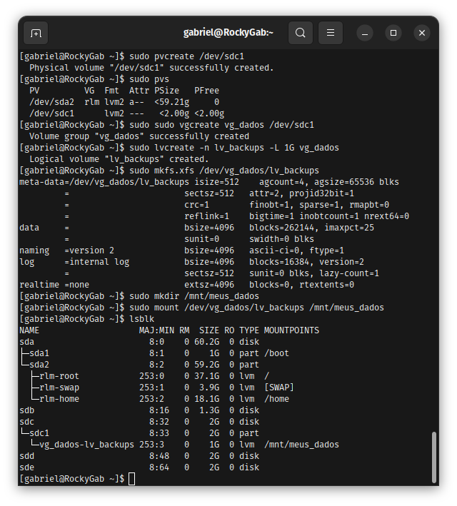

# Repo 04: Backbone Infrastructure & Networking 🚀

Repositório focado em administração de storage, redes e infraestrutura como código.

## 🛠️ Tecnologias
* **Storage:** LVM (Logical Volume Manager), XFS File System.
* **Infra:** Provisionamento de volumes escaláveis.

## 📈 Projetos e Evidências
### 01. Provisionamento LVM com XFS
* **Problema:** Necessidade de volumes de disco flexíveis para evitar downtime em expansões.
* **Decisão Técnica:** Implementação de LVM sobre partições físicas para permitir Online Resizing.
* **Evidência:** 
